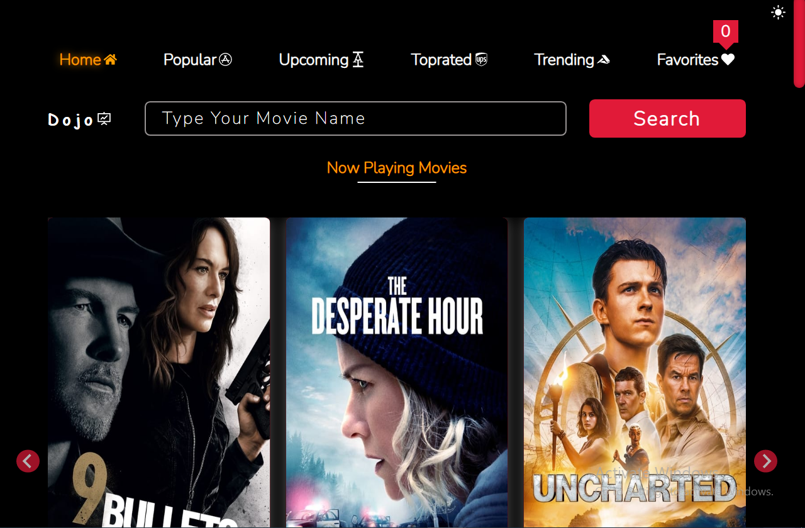
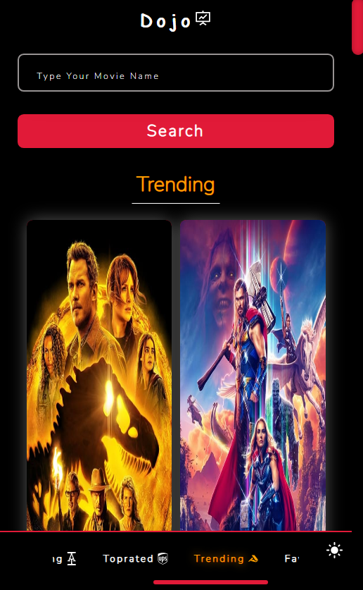
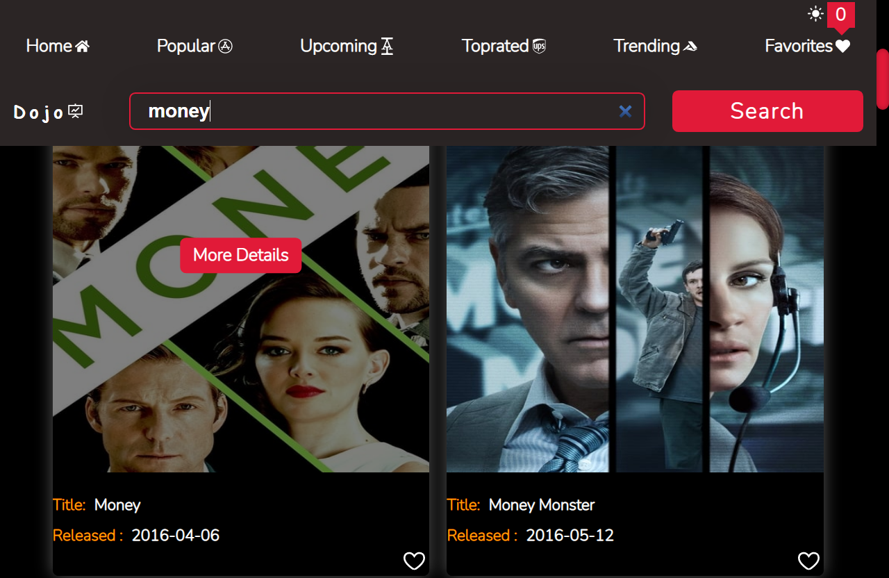
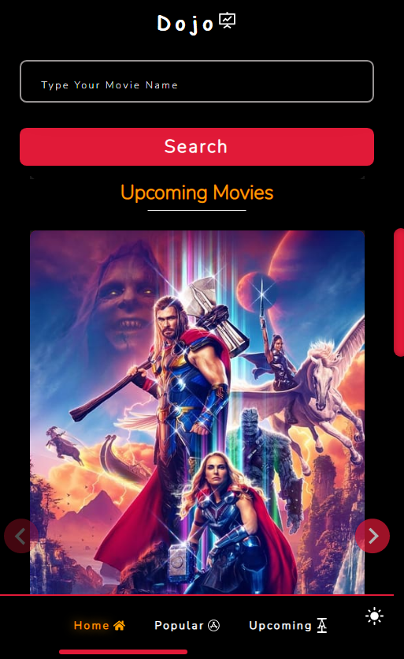

# Project Name
	Dojo Movies 🎬 App

# Demo link
 Preview App Demo [Dojo_Movies_App](https://dojomovies.netlify.app/)

## Table of Content: 📑
- [Project Name](#project-name)
- [Demo link](#demo-link)
	- [Table of Content: 📑](#table-of-content-)
	- [About The App: 📚](#about-the-app-)
	- [Screenshots: 📷](#screenshots-)
	- [Technologies & Languages:  ☕️ 🐍 ⚛️🧪📲](#technologies--languages--️--️)
	- [Approach: 🚶](#approach-)
	- [Some challenges when i code this app:](#some-challenges-when-i-code-this-app)
		- [1- localStorage:](#1--localstorage)
		- [2- Custom hook:](#2--custom-hook)
	- [Status: 📶](#status-)
	- [Credits Contributors images: 📝](#credits-contributors-images-)
	- [Fix issues or add some features:  💻](#fix-issues-or-add-some-features--)
	- [License ©️](#license-️)

## About The App: 📚

**Dojo Movies App** Is a delightful app for movie lovers where you can know about upcoming, trending, and most popular Movies.

movie story and save your favorite movie to favorite page, change between light & dark mode.

## Screenshots: 📷

|  Desktop   | Mobile  |
| ------------- | ---------- |
|   |   
|    |  

.

## Technologies & Languages:  ☕️ 🐍 ⚛️🧪📲
- html
- css
- react
- react icons
- react splide
- react router

## Approach: 🚶
 I tried to implement most of react features like:
	
> react-router | nested-router | react hooks | react-context | use-location | Custom Hook | and more ...
	

## Some challenges when i code this app:
 
  ### 1- localStorage: 
 
   I wanted to save dark mode status & save favorites 

`localStorage.setItem("test");`

  ### 2- Custom hook:
  I wanted to fetch diffrent resources 			like ( Trending | Popular | etc... ) 		movies.
 - So I created custom hook [ useFetching ] helped me to fetch diffrent urls across the app.( Appling DRY (don't repeat your self) concept )
 - ` using 👉	const { Data, isLoading, isError } = useFetching( url ) .`

## Credits Contributors images: 📝

>

## Fix issues or add some features:  💻
	- download or clone the repository
	- run npm install
	- npm start	
	- start fix issues or add some features
	- write clear commits describe all your changes
	- save all your changes 
	- pull your changes

## License ©️

All Copyright Save To   [**Ali Sabry**](https://www.linkedin.com/in/ali-sabry/)
